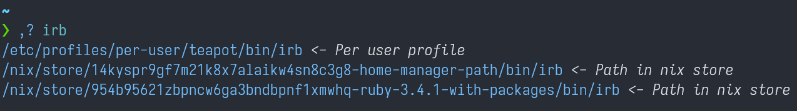
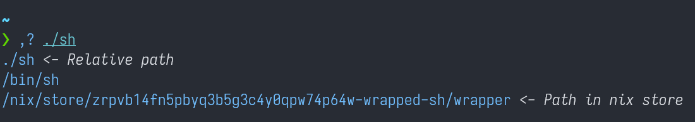
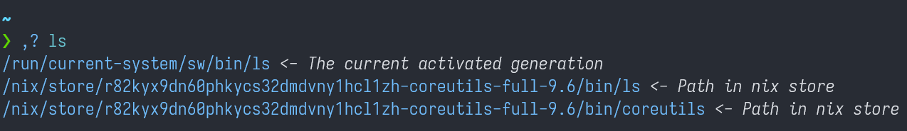

# Coruma

## coruma `(,)` the `comma` replacement.

*Not yet implemented as the motivation is low*

## coruma-reverse `(,?)` trace symlink to its origin

### Screenshots

|  |
|---|
| Specify an executable in $PATH by its name |

|  |
|---|
| It also accepts direct symlink path |

|  |
|---|
| Auto path correction. `ls` is linked to `coreutils` by relative path, but the output is automatically fixed |
